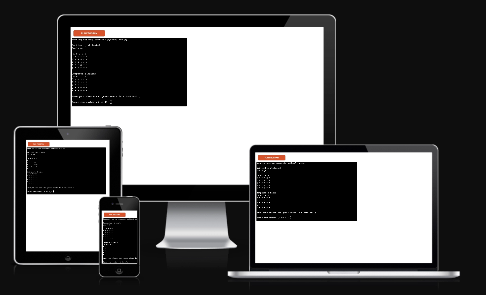
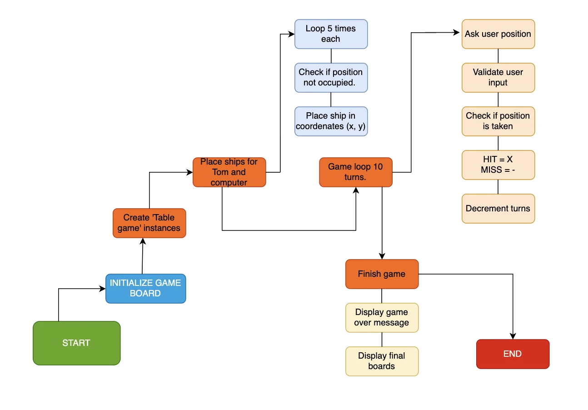
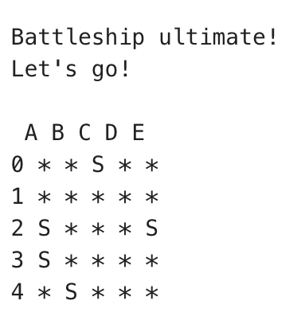
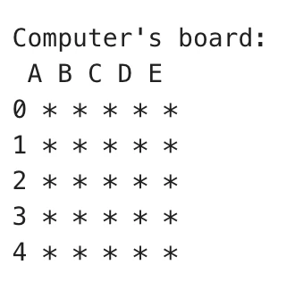
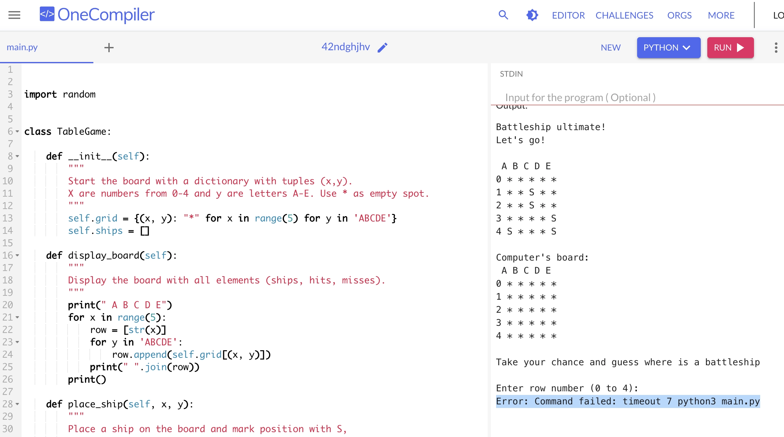
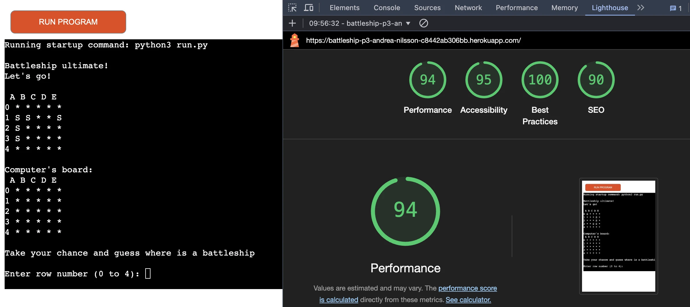

# Battleship-P3
 
Project 3
Code Institute

    This project has the workspace template from Code Institute. It's a simple battleship game using exclusively Python code. This game includes: two board, one for the computer and one for a user. Ten oportunities to guess wand hit where the computer's ships are and a track of hits and misses. At the end a message "Game Over" will be printed and the hits, misses and Ships that were in the board will be shown. 

DESIGN

There is no special design for this project because it's been exxlusiveky focused on Python the language and its functionality. The background color is only taken from the Code Institute template for this project. 

WIREFRAMES / FLOWCHART

    In this project I've usedcreated the flowchart using draw.io. The flowchart shows in resume the steps taken to acconplish the battle game and be functional. 

FEATURES

* The two game boards:

    In the beginning we have the two game boards. One for the user and the another for the computer.  
    The columns are marked with letters and the rows with numbers 0-4. Here I used just five rows and five columns to make the game easier. 

    The user board has "S" that means where the ships are. 

    The computer board has the ships hidden and the user has to guess where the ships are. 

    While the game is running, there will be a message saying "Take your chance and guess where is a battleship. 
    The user has to introduce the write information otherwise an error message is shown. 
    In the case that the player introduces other numbers that are not between 0-4 or letters that are not 'ABCDE'
    the error message will say "Try again, insert numbers between 0-4 and letters between 'ABCDE'!"

    The user has 10 turns until the ships are founded. If all the turns are finished the "Game Over" message will show. 

FUTURE IMPLEMENTATIONS: 

    ACCESIBILITY

    The page is easy to read and understand. The user will be able to restart the game using the button "run program".

    No other colors or fonts were used. 

TECHNOLOGIES USED

* Languages Used:

    I'm learning Python and this project is exclusively in that language.
    Gitpod it's been used for writing code and heroku for deployment. 
   
* Testing

    - The two boards for user and computer are seen in the screen.  
    - The site is avaiable and readable in on all devices. 
    - No errors of indentation were found in "CI Python Linter"
    - In "One Compiler" code tester appears a message "Error: Command failed: timeout 7 python3 main. 
      py". It's an error that doesn't appear as a big issue. The bugs section in README will cover more of this. 
    

    - The lighthouse open source from Chrome ensures that this website is not only fast and efficient but also accessible, SEO-friendly, and adhering to best practices.

* Bugs

    The biggest mistake I did was to not use indentation. Then I realized that my project was not running but the tutors helped me. 
    I still wish to have less functions to avoid repetition but I just need to learn more python to use Refactoring. After this project I will learn more about it. 
    
    My experience was that I should't create too many variables and better to create them when I need them. 
    I made some improvements and the quiz ended up functioning better.

    Some other problems that I found are:
    - Media query was difficult to adapt after I was done with most of the project. 
    - I had to go back to CSS theory because of details that I couldn't remember. 
    - JavaScript is a fun language but I need more projects to practice so I can apply more or the theory. 

* Owner stories 
GOALS AND PURPOSE WITH THE PROJECT
DETAIL ABOUT TARGET AUDIENCE

* Deployment

    The site was deployed to GitHub pages. The steps to deploy are as follows:

    - In the GitHub repository, navigate to the Settings tab.
    - From the "Code and automation" source select "pages"
    - On Github Pages find "Source", choose "deploy from a branch".
    - On branch you will find two dop-down menus. Choose "main", "root" and push the "save button".
    - Once the master branch has been selected, the page will be automatically refreshed with a detailed ribbon display to indicate the successful deployment.
    - The live link can be found here - https://github.com/Quetzaly88/Quiz-P2.git

* Code Used

    Most of the code I used was from my notes, the Stack overflow site, and the Love Maths project. 
    I realized that is hard to use the exact code from Replit because AI gives unacurate suggestions and I can't trust it. 
    Some code that was auto filling or giving sugentions are useful fot time management but many times was very unacurate. 
    I had assesory from a private teacher in Sweden (Superproff).  He made me think about several things that I could change so my project won't have too many functions and variables. 

CREDITS

- Wellesley Education. Helped me understand the functions on Javascript. 
    https://cs.wellesley.edu/~cs115/readings/more-functions.html#fig4
- Kevin Powell CSS. 
    https://youtu.be/3elGSZSWTbM?feature=shared
- Superproff private teachers. 
    https://www.superprof.se/
- Freecode camp. I've been practicing javascript in their website. Freecode camp helped me code while I was applying theory from Code Institute. I used this website and Freecodecamp to practice and learn more.
    https://www.freecodecamp.org/news/how-to-loop-through-an-array-in-javascript-js-iterate-tutorial/
    https://www.freecodecamp.org/learn/javascript-algorithms-and-data-structures-v8/
    https://youtu.be/le-URjBhevE?feature=shared
- Developer Mozilla. Helped me understand the event listener for my log-in form. 
    https://developer.mozilla.org/en-US/docs/Web/API/EventTarget/addEventListener
- Replit. Helped me to write my code before I used gitpod. 
    https://replit.com/
- Stack Overflow. It works almost like slack. Here I found a lot of questions and answers about javascript. 
    https://stackoverflow.com/
- Chrome Devtools. As I'm still learning how to use them this is a great tool to see mistakes and improve them. 
- Pomodoro focus helped me have breaks and time to focus so my body doesn't get so stressed. 
    https://pomofocus.io/

MEDIA CONTENT

- Mock up: https://ui.dev/amiresponsive
- Palette colors: https://coolors.co/
- Fonts: https://fonts.google.com/specimen/Exo+2?stroke=Sans+Serif&query=exo+2
- Fav icons: https://icons8.com/icons/set/quiz
- Webp converter app. https://anywebp.com/
- Wireframe: https://www.figma.com/design/bl6DMXwtOLRpX6XjRXwDif/Untitled?t=fSNs9KADQaAGOnzS-0

ACNOWLEDGEMENTS

    I want to thank specially to Tarek Bermalm. He is my private teacher in Sweden. He was a big support, he explained me details that hepled me understand and learn more. 

   