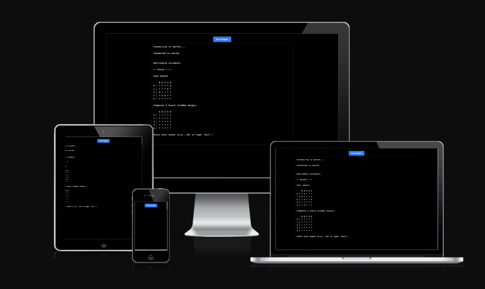

# Battleship-P3

**Project 3 Code Institute (Resubmission)**

    Battleship-P3 is a command-line battleship game built using Python. It allows a single player to compete against a computer opponent on a 5x5 grid. The aim of the game is to locate and sink the opponent's ships within a limited number of turns. The game runs in a terminal-like interface and is deployed via a web terminal using xterm.js and Heroku.

**DESIGN**

This project was built using a minimal design to emphasize core Python functionality. The frontend is styled in a simple terminal-like interface to simulate a console game. I used xterm.js for rendering. 

**WIREFRAMES / FLOWCHART**

    In this project I've used and created the flowchart with draw.io. The flowchart shows the steps taken to accomplish the battle game and the important steps for functionality.  

**FEATURES**

* Dual game boards:
    - Each player (user and computer) has their own 5x5 board.
    - Columns are labeled A–E and rows 0–4.
    - Ships are displayed only on the user's board for visibility; computer ships remain hidden.

* Turn-based logic:
    - The game allows up to 10 rounds.
    - In each round:
      * The user makes a guess.
      * The computer also guesses randomly without repeating.
    - Hits are marked with X, misses with -. 

* Error Handling:
    - Invalid inputs (e.g. wrong format, out-of-range) trigger informative error messages.
    - Duplicate guesses are not allowed.
    - Option to exit the game by typing exit.

* Game End Conditions:
    - User or computer wins by sinking all 5 opponent ships. 
    - If all rounds are used, the player with the most ships left wins.
    - In case of a tie, it is declared accordingly.

* Web Terminal Interface:
    - The game is played via an interactive xterm.js terminal embedded in a web page.
    - Powered by socket.io and python-shell to connect frontend and backend.

**TECHNOLOGIES USED**

* Languages:
    - Python (game logic)
    - JavaScript (frontend & server)
    - HTML/CSS (terminal display)

* Development Platforms:
    - GitHub for version control
    - Heroku for deployment

* Libraries & Tools
    - xterm.js – creates an interactive web terminal for player input/output
    - socket.io – enables real-time data flow between the terminal and game logic
    - python-shell – bridges JavaScript server with Python game
    - node-static – serves frontend files

**Manual Testing**
    - User input tested with valid and invalid coordinates. The error messages and instructions are working. 
    - Duplicate guesses rejected.
    - Game ends after 10 rounds or all ships are sunk. 
    - Computer guesses correctly without repeating. 
    - Game functions in local terminal (Python) and web terminal (Heroku). 
    - "exit" command ends the game gracefully
    - Final boards are displayed with all moves, the results and the winner are anounced. 
    - The Run Program button allows the user to reset the game and play again. 

**Bugs & Fixes**

    - Unlimited turns → Now limited to 10 rounds.
    - No winner declared → Winner/loser/tie logic added at end.
    - Computer was not playing → Added computer guess logic with memory.
    - Input crash on Heroku → Switched to sys.stdin.readline() with xterm.js frontend.
    - Game would crash on invalid input → All user input now validated with clear messages.
    - Winner was not shown clearly → End-of-game message shows player or computer win.

**Future Improvements**

- Save usernames and win/loss history.
- Improve readability and UX experience. 

**Owner stories**

    I built this project to improve my Python skills and understand real-time input handling. I tested the game myself in the terminal and in the Browser. Even my daughter (age 10), could follow the game easily, because is explainful and clear.

**Deployment**

* HEROKU
    - Created Heroku app
    - Added Python and Node.js buildpacks (in that order)
    - Created Procfile with web: node server.js
    - Pushed to Heroku and opened live terminal app. 

**Code Used**

    - There were many new additions in this project. I used ChatGPT to learn and implement features I wasn’t familiar with, especially related to web deployment and real-time input"
    - The deployment after migration from Gitpod to VS code was a challenge. I had a lot of difficulties with the server.js, xterm.js and socket.io. Thanks to chat gpt I was able to deploy and restart the deployment several times. I found very interesting how is possible to have different ways to work and obtain good results in coding. 
    - I used help from chat gpt for the buffering too. 
    

**CREDITS**

- 100 days of coding in Udemy, from Dr. Angela Yu. 
    (https://www.udemy.com/share/103IHM3@LSb44Ppc1io0Phvhc0EZ9mIfy1O6bTGmTtNQx3xWUywQ5Pkh3jLvZf9qvBGQu2ku/)

- Freecode camp. I've been practicing a little bit of python in their website. 
   (https://www.freecodecamp.org/learn/scientific-computing-with-python/)

- Slack. Here I found a lot of questions and answers about python and the challenges. 

- Pomodoro focus helped me have breaks and time to focus so my body doesn't get so stressed. 
    (https://pomofocus.io/)

- I learned more about indentation. 
    (https://realpython.com/python-pep8/)

- Most of my questions were answered in W3 schools. 
    (https://www.w3schools.com/python/)

- Youtube python code videos.  
    (https://youtu.be/eWRfhZUzrAc?feature=shared)
    (https://youtu.be/tF1WRCrd_HQ?feature=shared)
    (https://youtube.com/playlist?list=PL-osiE80TeTt2d9bfVyTiXJA-UTHn6WwU&feature=shared)

- Chat GPT. 
    (https://chatgpt.com/)

**MEDIA CONTENT**
    - CI lintern, tester. https://pep8ci.herokuapp.com/
    - Mock up: https://ui.dev/amiresponsive
    - Webp converter app. https://anywebp.com/
    - Wireframe/flowchart. https://app.diagrams.net/
    - Validator. https://onecompiler.com/python/42ndghjhv

**ACKNOWLEDGEMENTS**

    I want to thank the Udemy course and Anna Grieves for the good explanation on Python code. The walk through project was well explained as it was the deployment process. The tutors were there to help me when I needed. 
    I'm proud of myself for being able to learn more and apply everything I learned from the previous projects. I'm faster in my typing and I can find ansers to my questions easier than before. 
